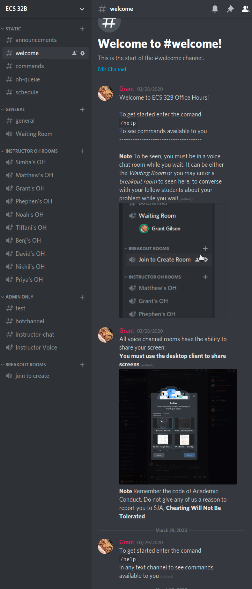

## Portfolio

---

### [OH-Bot](https://github.com/ECS-OH-Bot/OH-Bot)
<!--  -->

#### Purpose
-------

With the need for online learning becoming increasingly higher,
efficient means of reaching educators has become extremely important. We
implemented a discord bot to help instructors automate the process of
their Office Hours through Discord.

We created this bot with the goal of allowing students to effectively
communicate with their instructors, with the option to be able to ask
their peers for help while they wait.

#### Overview
--------

OH-Bot is a server managment automation bot. This means that tasks
like notifying and moving students when they are ready to been seen are
handled by OH-Bot

OH-Bot is a self-hotsted bot - meaning that you will need to host
and maintain your own instance. See [Quick Start](#quickstart) to get
started.

The standard OH-Session protocol that we follow: 
1. Instructors Opens OH-Queue 
2. Students enter queue and enter waiting room 
3. Instructors dequeue students 
4. Instructors close queue when OH-Session is over
   
--------

[Missing CS Class](https://gitlab.com/missing-cs-quarter-ucd/lecture-slides)

### Category Name 2

- [Project 1 Title](http://example.com/)
- [Project 2 Title](http://example.com/)
- [Project 3 Title](http://example.com/)
- [Project 4 Title](http://example.com/)
- [Project 5 Title](http://example.com/)

---

---

Page template forked from <a href="https://github.com/evanca/quick-portfolio">evanca</a>

<!-- Remove above link if you don't want to attibute -->
